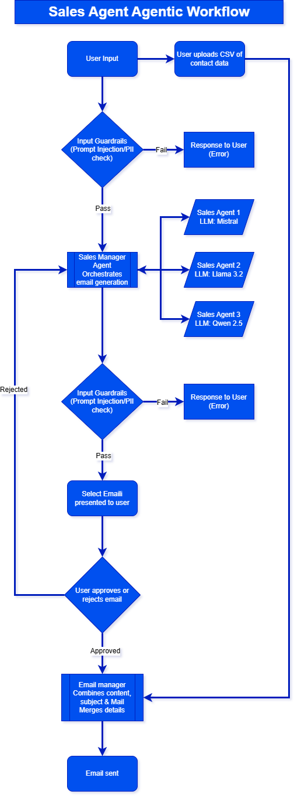
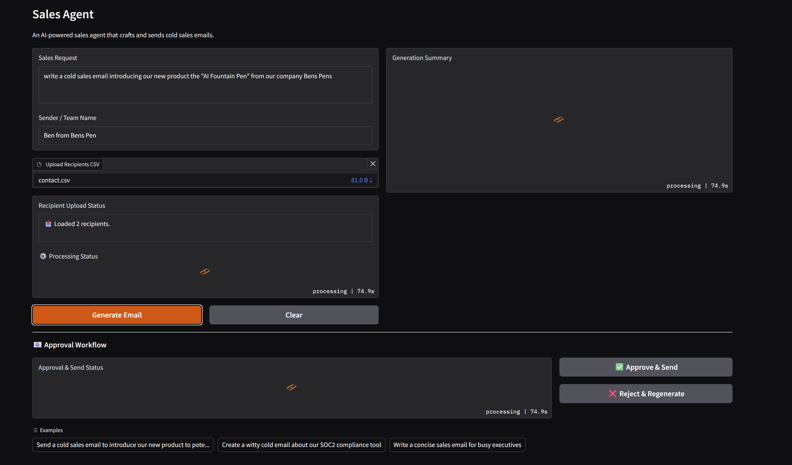
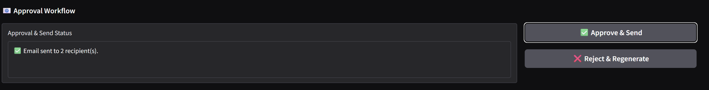

# Sales Agent

An Agentic AI portfolio project that showcases multi-agent orchestration, safety guardrails, CSV mail merge, and automated sending—powered by the official OpenAI Python SDK (pointed at a local Ollama endpoint by default).

## ✨ Features

1. **Agentic orchestration:** A Sales Manager agent coordinates three specialist writers (professional, humorous, concise) and automatically selects the best draft via scoring.
2. **OpenAI SDK + local bridge:** Uses the OpenAI Python SDK while allowing custom `base_url` + key so you can run against OpenAI-hosted models or self-hosted ones (e.g., Ollama).
3. **Safety guardrails:** Prompt-injection/PII checks on input and secret-leak checks on output via `GuardrailFunctionOutput` hooks.
4. **CSV-driven personalization:** Upload a `name,email` CSV and a sender/team name; approval triggers personalized replacements such as `[Recipient name]` and `[Your name]` before sending.
5. **Approval workflow:** Approve & Send or Reject & Regenerate, with success/failure reporting per recipient.

## 🧠 Agentic Workflow

The flow diagram below maps the full process:

- **User prompt + CSV upload** → `interface.py` collects the message, sender name, and recipients.
- **Input guardrail** (`comprehensive_input_guardrail`) scans for prompt injection + PII. Fails route back to the user with detailed logging.
- **Sales Manager agent** runs atop the OpenAI SDK (`OpenAIChatCompletionsModel`), delegating to three writing agents (mistral, llama3.2, qwen2.5) for diverse drafts.
- **Candidate scoring** chooses the strongest draft and composes a summary with per-agent scores.
- **Output guardrail** (`comprehensive_output_guardrail`) ensures no secrets or credentials leak.
- **Approval loop:** Users either regenerate or approve. Approval invokes the Email Manager agent, which polishes the draft and mail-merges placeholders per recipient before calling SendGrid.
- **Email delivery:** Each recipient receives a personalized email with tokens replaced and HTML formatting applied, and the UI reports send status.



## 🖼️ UI Walkthrough

| Step | Screenshot |
|------|------------|
| Compose request, set sender name, upload CSV |  |
| Review generated draft + candidate scores |  |
| Approve, send, or regenerate |  |

## 🚀 Getting Started

1. **Install deps**

   ```bash
   pip install -r requirements.txt
   ```

2. **Configure `.env`**

   ```env
   LLM_API_URL=http://localhost:11434/v1  # or https://api.openai.com/v1
   LLM_API_KEY=your-key
   SENDGRID_API_KEY=sg-...
   FROM_EMAIL=you@company.com
   TO_EMAIL=optional-default@company.com
   ```

3. **Run the UI**

   ```bash
   python interface.py
   ```

4. **Use the app**
   - Enter the sales request and sender/team name.
   - Upload a CSV such as `Docs/Example-contacts.csv`.
   - Generate → review → approve/send. Logs track guardrail status and SendGrid deliveries.

## 🛡️ Guardrails

- **Input guardrail:** Regex-based prompt-injection + PII detection with configurable `RISK_THRESHOLD`. Blocks high-confidence detections and returns structured metadata.
- **Output guardrail:** Secret-leak detection (API keys, passwords). Extend `leak_patterns` for additional credentials. Both guardrails log JSON records for observability.

## 📂 Repo Structure (highlights)

```text
├─ agent_setup.py        # Defines agents, LLM models, and tools
├─ interface.py          # Gradio UI, mail merge, approval workflow
├─ guardrails.py         # Input/output guardrail logic
├─ email_service.py      # SendGrid integration + tool wrapper
├─ Docs/
│   ├─ img/              # Flow diagram + UI screenshots
│   └─ Example-contacts.csv
└─ requirements.txt
```

## ✅ Portfolio Notes

- Built entirely with the **OpenAI Python SDK**, highlighting how to retarget it to local inference endpoints.
- Demonstrates practical AI-engineering skills: multi-agent coordination, safety instrumentation, async orchestration, and transactional email delivery.
- Ready for demos: update `.env`, provide a CSV, and click “Generate Email.”